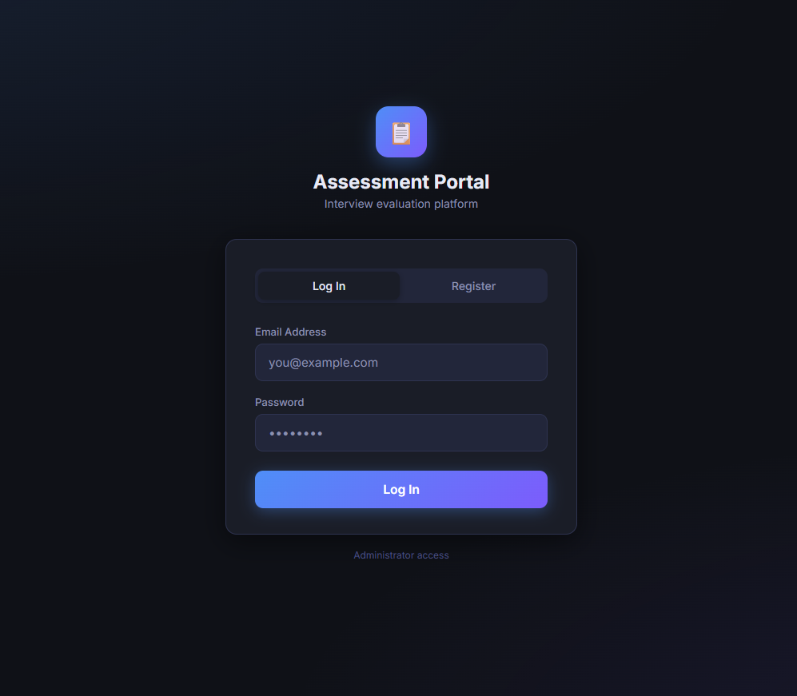
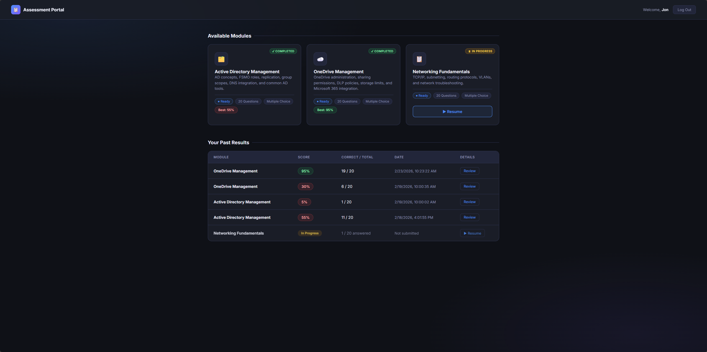
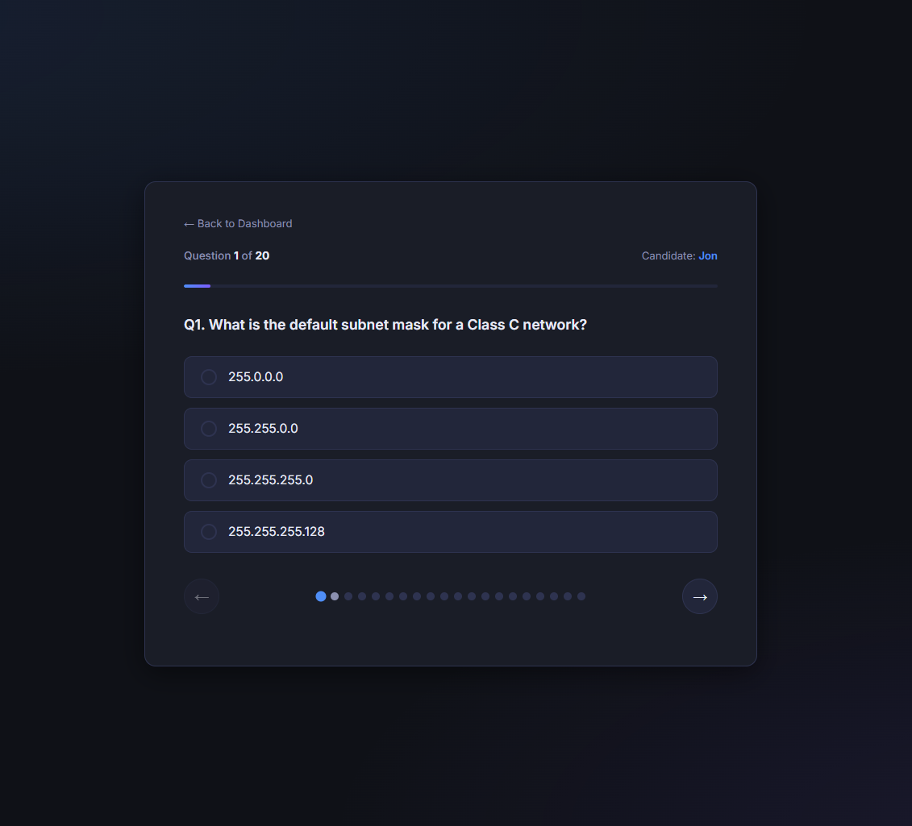
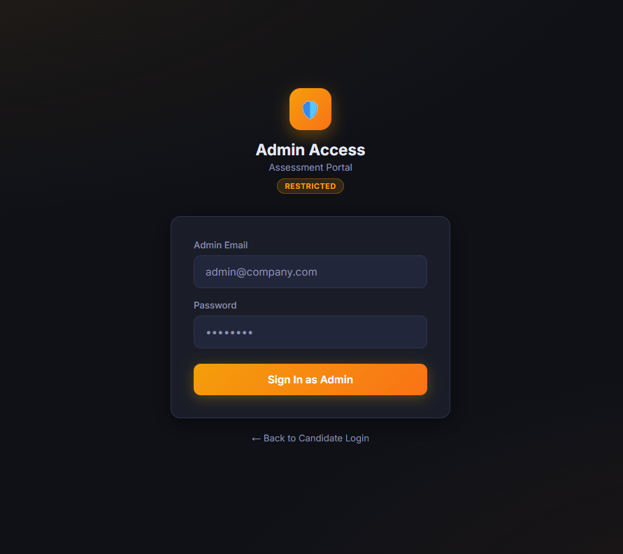
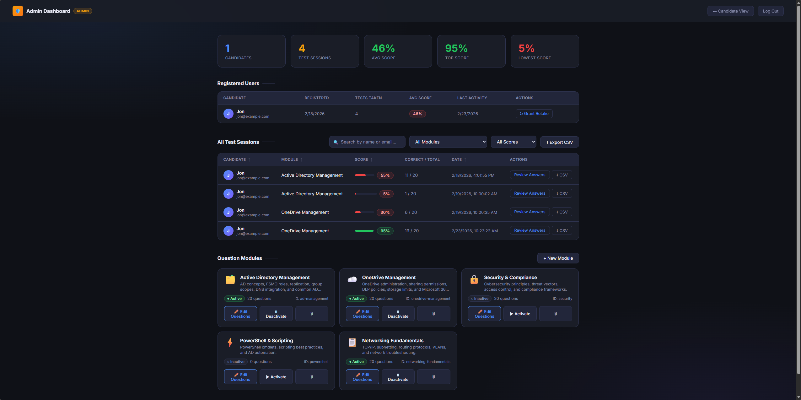

# Assessment Portal

A modern, responsive, and secure assessment platform built for creating, managing, and taking customizable quiz modules.

<br>
### Candidate Experience
<p align="center">
  
  
  
</p>

### Administrator Experience
<p align="center">
  
  
</p>
<br>
## 🚀 Features

### For Candidates
* **Seamless Quiz Experience**: A clean, intuitive interface for taking assessments.
* **Progress Tracking & Auto-Save**: Answers are automatically saved as candidates progress through the quiz, allowing them to resume safely if interrupted.
* **Instant Results**: Detailed score breakdowns and answer reviews immediately upon submission.
* **Email Notifications**: Automatic email delivery of assessment results (if configured with SendGrid).

### For Administrators
* **Powerful Dashboard**: A comprehensive admin dashboard to oversee all candidate activity, scores, and module statuses.
* **Module Management**: Create, edit, and deactivate quiz modules on the fly.
* **Bulk Question Import**: Easily populate quiz banks by importing questions directly from CSV files.
* **Retake Grants**: Granular control to grant specific candidates the ability to retake specific modules. 
* **Data Export**: Export candidate session results to CSV for external reporting.

## 🛠️ Tech Stack

* **Frontend**: HTML5, Vanilla JavaScript, CSS3 (Custom responsive design with modern glassmorphic elements)
* **Backend**: Node.js, Express.js
* **Database**: SQLite (via `better-sqlite3`)
* **Authentication**: JWT (JSON Web Tokens) & `bcryptjs` for secure password hashing
* **Emailing**: SendGrid API

## 📦 Local Setup & Installation

### Option 1: Running with Docker (Recommended)
This approach encapsulates the application and its environment. 

1. **Clone the repository**:
   ```bash
   git clone https://github.com/freakinfofa/Intrviewz.git
   cd Intrviewz
   ```

2. **Run with Docker Compose**:
   ```bash
   docker compose up --build -d
   ```
   The application will be available at `http://localhost:3000`.

### Option 2: Running with Node.js
Ensure you have [Node.js](https://nodejs.org/) installed on your machine.

1. **Clone the repository**:
   ```bash
   git clone https://github.com/freakinfofa/Intrviewz.git
   cd Intrviewz
   ```

2. **Install Dependencies**:
   ```bash
   npm install
   ```

3. **Start the Application**:
   ```bash
   npm start
   ```
   The application will be available at `http://localhost:3000`.

## 🔐 Environment Variables

To configure email notifications or secure the session logic, you can define the following variables in an `.env` file at the root of the project:

```env
PORT=3000
JWT_SECRET=your_super_secret_jwt_key
ADMIN_EMAIL=admin@company.com
ADMIN_PASSWORD=Admin@1234
SENDGRID_API_KEY=SG.your-api-key-here
SENDGRID_FROM=noreply@yourdomain.com
NOTIFY_EMAIL=hr@yourdomain.com
```

## 📚 Built-in Seed Data
On the very first run, the database is automatically seeded with introductory modules (e.g., Active Directory Management, OneDrive Management, Networking Fundamentals) and question banks to help you test the platform immediately. 
